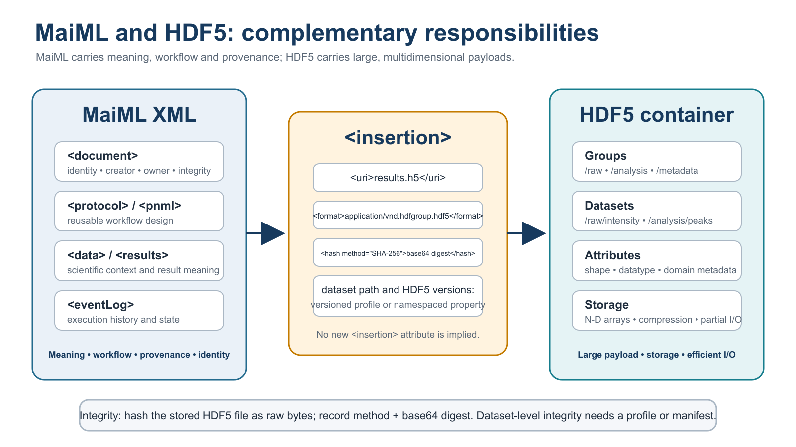
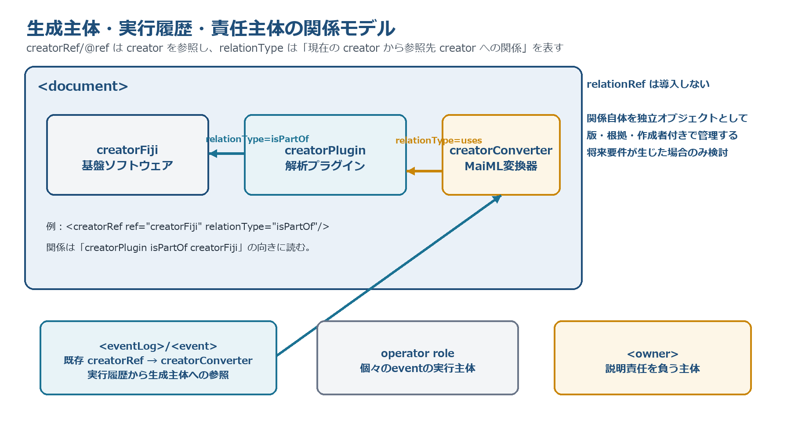

# MaiML Operational Guideline

**Informative separate document**  
Applies to: MaiML Working Draft and schema release 1.1.0  
Version 0.8.14 (Draft)  
Prepared by: VAMAS TWA 2 Project A45 Study Team  
2026

> This Markdown edition is a working English translation derived from the saved Japanese Word edition v0.8.14. It is provided for review and publication preparation and has not been independently approved.

## Contents

- [Preface (Positioning)](#sec-0)
- [1 Operation of identifiers (UUIDs)](#sec-1)
- [2 Operation of findability](#sec-2)
- [3 Operation of access control and confidentiality](#sec-3)
- [4 Operation of external files, hashes and authoritative sources](#sec-4)
- [5 Operation of namespaces, vocabularies and relation vocabularies](#sec-5)
- [6 Operation of numerical values, units and uncertainty](#sec-6)
- [7 Operation of a minimum reproducibility profile](#sec-7)
- [8 File granularity and derivation management](#sec-8)
- [9 Integration with operational systems (ELN/LIMS/SDL)](#sec-9)
- [9.1 Recording multiple results and execution history](#sec-9-1)
- [10 Authoring support, validation and visualization](#sec-10)
- [11 Signatures, canonicalization and tamper detection](#sec-11)
- [12 Operational checks for FAIR+G and ALCOA+](#sec-12)
- [13 Workflow design (Workflow Engineering)](#sec-13)
- [14 Management of schema releases and namespaces](#sec-14)
- [15 Operation of creatorRef and relationType](#sec-15)
- [16 Authoring, publication and acceptance checklist](#sec-16)
- [17 Naming and validation of local ids](#sec-17)
- [18 Operation of owner using role names or pseudonymous identifiers](#sec-18)
- [19 Treatment of duplicate definitions with the same UUID](#sec-19)
- [References](#references)

## Preface (Positioning)

This document is an informative document that does not add conformity requirements to the MaiML standard text or XML schema. It provides recommended procedures for connecting the identification, structure, relations, provenance, signatures and encryptable scope provided by MaiML to UUID issuance, key management, access control, preservation, discovery, vocabulary management and tool operation [1], [2].

This document primarily organizes the matters classified during the ILC (RRT1–3) as C: operational guideline (13 comments) and E: outside the responsibility of the specification (18 comments). The 203 RRT comments were classified as A39/B70/C13/D14/E18/–49. The procedures in this document are best practices and do not replace the applicable laws, contracts, quality-management arrangements or information-security policies of an implementing organization.

Table 0-1 — Allocation of responsibilities in the MaiML document framework

| Layer | Responsible party | Content | Relationship to conformity |
| --- | --- | --- | --- |
| Specification (normative) | WD body and versioned XSD | Structure, identification, relations, history and encryptable scope | Conformity requirements |
| Application guidance (informative) | Informative WD annexes | Description patterns, complete examples and mappings | Interpretation support |
| Operation (this document) | Organization and operational infrastructure | ID issuance, keys, vocabularies, preservation, access and profiles | Organization-specific assurance |
| Tools/implementation | Reference implementations and products | Generation, visualization, validation, conversion and indexing | Implementation checks |
| External infrastructure | Repositories, authentication infrastructure, etc. | Discovery, authentication, authorization, long-term preservation and vocabulary definitions | Outside the responsibility of the specification |

In this document, the term “assurance” does not mean that an assurance objective is achieved merely because a MaiML element exists. MaiML provides the information and structure required for evaluation and verification; assurance of authenticity, confidentiality, availability and accountability is established by combining verification implementations with operational controls.

Table 0-2 — Principal operational roles

| Role | Principal responsibilities | Records retained |
| --- | --- | --- |
| Schema Maintainer | Publish XSDs, namespaces, change history and validation examples as versioned releases | Release manifest, checksums and migration records |
| Identifier Authority | Issue and transfer UUIDs, handle duplicates and collisions, and prohibit reassignment | Issuance register, external-ID mapping and audit trail |
| Data Producer | Create MaiML and record values, units, relations and provenance | Creation log, profile and validation results |
| Data Steward | Manage vocabularies, preservation, disclosure scope, authoritative sources and quality review | Vocabulary register, preservation policy and approval records |
| Security Administrator | Manage keys, certificates, RBAC, revocation and decryption permissions | Key register, access logs and revocation records |
| Repository Operator | Store originals and derivatives, index them, provide persistent URIs and validate on retrieval | Storage logs, hashes and backup records |

## 1 Operation of identifiers (UUIDs)

UUIDs are used for global identification of subjects, whereas the id attribute is used for local identification within a document; they are not interchangeable. This guideline uses UUIDv4 by default. UUIDv3 or UUIDv5 is used only for equipment, software or another subject where an organization can manage a fixed namespace UUID and a rule that uniquely and reproducibly generates a normalized name octet sequence from the subject being identified. In accordance with RFC 9562, UUIDv5 is preferred to UUIDv3 where possible. When an external identifier such as a DOI, ORCID or ROR is used as input, the normalization rule for the input string, namespace UUID, generation algorithm and algorithm version are recorded. UUIDv7 is not adopted. The timestamp of an `<event>` or an external index is used for chronological searches. When the same UUID is maintained across different files, the identity of the subject is verified using an authoritative identifier register or an equivalent verifiable record, and the verifying party, date and time, applicable version and basis are retained in the audit record [3].

Table 1-1 — UUID issuance, propagation and exception handling

| Stage | Recommended procedure | Record |
| --- | --- | --- |
| Registration of an existing sample | Accept an existing UUID after the Identifier Authority verifies identity against an authoritative register or equivalent verifiable record. | Subject, issuer, verification date/time, applicable version and basis |
| Newly generated object | Issue a new UUID when the process is complete. Record the relation to the input according to its meaning: use `<parent>` for a revision source, `<chain>` for file linkage, and `<templateRef>`/`<instanceRef>` for a template/instance relation. Represent other derivation relations using an explicit relation mechanism or profile. | Input UUID, output UUID, relation type and process |
| Change of state | Propagate the UUID only when the subject can be verified to be the same entity, and distinguish its state using condition or eventLog. Otherwise, issue a new UUIDv4. | Basis of identity, state, time and operation |
| Transfer to MaiML | Transfer the UUID through an API or selection interface; do not use copy-and-paste as the normal procedure. | Sender, recipient and verification result |
| Retry | Use an idempotency key that identifies the same request so that retries do not issue multiple UUIDs. | Request ID and issued UUID |
| Collision or duplicate | Quarantine the subject, do not reuse the UUID, issue a new UUID, and retain the mapping from the old value in the audit record. | Old value, new value and affected scope |
| Derivation or anonymization | Treat a public copy whose content has been changed through anonymization as a revision, assign a new UUID and identify the original as the revision source using `<parent>`. Record other derivation relations using an explicit relation mechanism or profile. | Reason for derivation, processing, relation type and hash |
| Retirement | Do not reassign an issued UUID to another subject. Retain tombstone metadata even after deletion. | Reason for retirement and retention period |

- External identifiers such as DOI, ORCID, ROR and equipment asset numbers do not replace UUIDs; their correspondence is managed in a mapping table.

- The same UUID may be maintained only where the subject can be verified to be the same entity. If this cannot be verified, or if a new entity, result or derived content is created, a new UUIDv4 is issued. This decision and its evidence are specified in a profile or SOP.

- Procedures for offline issuance, subsequent synchronization and collision checks are established in advance for periods when the issuance service is unavailable.

**Figure 1-1 — Decision process for maintaining the same UUID**

## 2 Operation of findability

UUID, chain and parent support identification and navigation from a known subject, but they are not search indexes. To make MaiML findable, the document UUID, sample, method, instrument, creator, date and time, profile, licence and principal vocabulary terms are registered in a repository or data catalogue.

- Forward resolution: provide a resolver through which a UUID or persistent URI leads to the MaiML document or access instructions.

- Reverse lookup: index `<parent>` as a revision relation, `<chain>` as a file-linkage relation, and ref according to the reference relation defined for each element. To search for general derivation relations, use a relation mechanism or profile that states the intended meaning explicitly.

- For data outside a user's authorization, determine the extent of public metadata that may disclose existence, an identifier, a contact point or an application procedure.

- Retain the correspondence between catalogue-specific IDs and MaiML UUIDs so that the index can be rebuilt.

## 3 Operation of access control and confidentiality

W3C XML Encryption specifies how to encrypt an XML element or its content, but it does not specify keys, users or access policies [5]. Schema release 1.1.0 permits `<EncryptedData>` in descendant content of a global element, except `<uuid>`, and in the content of `<property>` and `<content>`. Tags, attributes, `<uuid>` and information required for reference resolution are retained. An organization defines classifications such as public, restricted to a collaboration, internal and confidential, and selects content for protection within that scope. An external file referenced by `<insertion>` may be encrypted separately; its encryption method, decryption and key management are outside the scope of the MaiML XML schema.

Table 3-1 — Operational decisions for confidentiality and access control

| Target | Recommended | Avoid |
| --- | --- | --- |
| Structure and identifiers | Retain, where possible, the workflow skeleton, uuid, refs and the existence of encrypted locations | Hiding information required for reference resolution without a plan |
| Sample, composition and recipe | Encrypt at the content level and retain a separate public description | Distributing content with a changed meaning under the same UUID |
| Anonymization and pseudonymization | Treat a public copy whose content has been changed through anonymization as a revision, assign a new UUID and identify the original as the revision source using `<parent>`. Represent other derivation relations using an explicit relation mechanism or versioned profile. Manage the mapping to the original under access control. | Treating anonymized content as identical to the original, or repurposing `<parent>` as a general derivation relation |
| RBAC | Separate viewing, creation, approval, decryption and key-management roles | A single shared account or indefinite sharing of a decryption key |
| Keys | Manage the key ID, owner, validity period, revocation, backup and recovery testing | Storing the key itself in clear text in the MaiML document |

## 4 Operation of external files, hashes and authoritative sources

The `<insertion>` element in schema release 1.1.0 references an external file. Images, spectra, HDF5 files and instrument-specific binaries are typical examples. `<uri>` identifies the location, `<hash>` identifies the retrieved file content, and `<format>` identifies the interpretation format. A hash of an external file is calculated over the complete raw byte sequence of the stored object; the algorithm identifier is recorded in the method attribute of `<hash>`, and the digest is recorded as the base64Binary value defined by the schema. Literature, databases or cloud resources are referenced when fixed as external files, or when a versioned profile explicitly extends the target scope. The latter case is not confused with conformity to the current base schema.

HDF5 is a container that uses groups, datasets and attributes to hold large, multidimensional scientific data and supports operations such as partial reads [16], [17]. MaiML does not replace HDF5; it references HDF5 as an external payload from `<insertion>`. Record the HDF5 file in `<uri>`, the method attribute and the base64Binary digest calculated from the entire byte sequence of the stored file in `<hash>`, and application/vnd.hdfgroup.hdf5 in `<format>`. The HDF5 dataset path, file-format version, library version and filter/codec dependencies are specified separately in a versioned profile or a namespaced property. This is not interpreted as adding a dataset-path attribute to the current `<insertion>` element.

**Figure 4-1 — Division of responsibilities between MaiML and HDF5**

Table 4-1 — Information recorded when HDF5 is referenced as an external payload

| Item | Information recorded | Reason for verification |
| --- | --- | --- |
| `<uri>` | Relative or persistent URI of the fixed HDF5 file | Resolve the referenced object after relocation |
| `<hash>` | method attribute and base64Binary digest over the raw bytes of the complete stored HDF5 file | Verify the algorithm and identity of the retrieved content |
| `<format>` | application/vnd.hdfgroup.hdf5 (also record .h5 or .hdf5 where needed) | Identify the interpretation format |
| dataset path | Map, for example, /raw/intensity using a versioned profile or namespaced property | Identify the target dataset within the file |
| Dependency versions | Names and versions of the HDF5 file format, library and filters/codecs | Support long-term readability and reproducibility |
| Dataset-level integrity | Record a digest in a separate manifest or profile where required | The `<insertion>` hash normally covers the entire file |

- When a relative URI is used, fix the base MaiML document or container root.

- When a repository is relocated, add the new URI and retain the history of the previous URI and hash.

- When external metadata is copied into MaiML, define the authoritative source, retrieval time, source version and precedence rule for discrepancies.

- Do not overwrite a file. Assign a new UUID and a new hash to the new immutable artifact. Use `<parent>` to identify the revision source, and `<chain>` to link to and verify the hash of a previously created file. General derivation relations are represented using an explicit relation mechanism or versioned profile.

- For long-term preservation, retain the format specification, reading software, MIME type or other identifier, and required calibration information.

## 5 Operation of namespaces, vocabularies and relation vocabularies

An XML namespace indicates the source and identification scope of a vocabulary and prevents collisions between identically named terms, but it does not guarantee their meaning. An organization manages the namespaces, vocabulary versions, terms, definition URIs, status and corresponding terms that it uses in a vocabulary register.

- Reuse published URIs, and do not silently change the meaning of an existing term when a version changes.

- Record additions, deprecations, replacements and effective dates of terms in a changelog.

- Manage relationType using a controlled vocabulary with a defined direction or a namespaced IRI, rather than as an unrestricted string.

- Represent synonym, broader/narrower and mapping relations in an external ontology, and do not confuse its role with that of the MaiML namespace.

## 6 Operation of numerical values, units and uncertainty

formatString specifies a display format; it does not represent significant figures, precision or uncertainty. For a physical quantity, record units and retain scaleFactor, the data type, the value and `<uncertainty>` separately. Consider rounding differences when decimal values are handled as binary float or double values, and do not reconstruct a stored value from its formatted character representation [8].

- Define recommended unit sets, notation, conversions and calibration information for the organization or domain.

- Where practicable, associate `<uncertainty>` with the applicable value, standard or expanded uncertainty, coverage factor, confidence level and basis of calculation.

- For conversion tools, perform round-trip tests for decimal→float→decimal conversion, unit conversion, scaleFactor and missing values.

- Distinguish calculated values from measured values, and record the physical constants used and their versions.

## 7 Operation of a minimum reproducibility profile

A minimum reproducibility profile is an operational agreement that enumerates the elements required to repeat or reanalyse work for a specified purpose. A profile includes a persistent identifier, version, applicable method, mandatory and conditional items, permitted vocabularies, validation rules, responsible party and deprecation policy.

Table 7-1 — Administrative information included in a profile

| Item | Content |
| --- | --- |
| Identification | Profile ID, version, publication date, URI and maintaining organization |
| Scope | Method, sample type, purpose and inclusion/exclusion conditions |
| Required information | Sample, condition, protocol, result, eventLog, calibration and external files |
| Validation | Rules applied in addition to XSD, permitted vocabularies, units and thresholds |
| Compatibility | Applicable MaiML schema version and migration from an earlier profile |

## 8 File granularity and derivation management

Determine file granularity from the frequency of change, permissions, unit of reuse, volume of external files and signature unit. Even when multiple processes are included in one document, identify each sample, condition and result with a UUID. When documents are separated, connect process inputs and outputs using `<chain>` and explicit refs. Use `<parent>` to identify the revision source only when the separated document is a revision.

- Treat a published or signed MaiML document as immutable; create a new artifact for a correction, reanalysis or anonymization.

- Document the recommended granularity—such as per sample, measurement or analysis—in a profile.

- Do not combine information with substantially different access permissions in one document; select partial protection or document separation.

## 9 Integration with operational systems (ELN/LIMS/SDL)

Use an ELN or LIMS as the Identifier Authority and holder of the primary record, and transfer the identifiers of samples, instruments, users, protocols and external files through an API or controlled selection interface when generating MaiML. MaiML does not control instruments; it structures the hand-off points to external layers such as LADS OPC UA, SiLA 2, CWL, WDL and RO-Crate.

**Figure 9-1 — MaiML operational lifecycle and verification points**

Table 9-1 — Transfer from an ELN/LIMS to MaiML

| Subject | Issuer/holder | Transfer to MaiML | Verification |
| --- | --- | --- | --- |
| Sample | LIMS item/sample record | material UUID/external ID | Subject, lot and storage location |
| Experiment | ELN experiment/workflow | document UUID and protocol/templateRef | Version, execution date and approval |
| User | Authentication infrastructure/ELN | creator and owner (including the operator role) | Account, affiliation and role |
| External file | Repository/ELN upload | insertion URI, hash and format | Raw-byte hash on retrieval |
| Execution history | Instrument/ELN event | eventLog, time, state and creatorRef | Clock synchronization, omissions and duplicates |

### 9.1 Recording multiple results and execution history

Do not mechanically equate the number of `<results>` elements with the number of `<log>` or `<trace>` elements. A `<log>` is a group of history records corresponding to a method, a `<trace>` represents one execution based on a program, and an `<event>` represents an operation corresponding to an instruction. When one execution generates multiple results, reference each result using resultsRef from the applicable event in the same trace. When the same process is repeated, use a separate trace for each execution; use separate logs for different methods. An ELN, LIMS or execution engine should issue a trace identifier at the start of execution and automatically associate the event with resultsRef when each result is generated.

## 10 Authoring support, validation and visualization

MaiML is human-inspectable XML text. However, a Viewer is effective for understanding the complete structure of multiple UUIDs, complex workflows and numerous files. During authoring, use an ELN/LIMS, converter or dedicated editor to prevent manual entry of UUIDs, selection of an incorrect reference target, and errors in types, units and cardinalities.

Table 10-1 — Staged validation

| Stage | Check | Treatment on failure |
| --- | --- | --- |
| 1 XML | Well-formedness, character encoding and namespace declarations | Stop creation |
| 2 XSD | Elements, attributes, types, cardinalities and ID/IDREF | Not conforming |
| 3 Identification and references | Duplicate UUIDs, refs, chain, parent and template/instance | Quarantine and correct |
| 4 Numerical values and profile | units, scaleFactor, uncertainty, mandatory items and vocabularies | Not conforming to the profile |
| 5 External resources | URI reachability, hash, format and authoritative source | Record omission or change |
| 6 Signature and encryption | Canonicalization, Reference, digest, signature and decryption permissions | Treat authenticity as unverified |
| 7 Display | Review hierarchy, workflow, chronology and relations in a Viewer | Withhold human approval |

Use https://maiml-org.github.io/ as an entry point to public tools and reference implementations. In an operational environment, however, pin the adopted release, commit or distribution checksum rather than following the latest version on the site unconditionally [13].

## 11 Signatures, canonicalization and tamper detection

XML Signature supports verification of the integrity of a referenced target and of a signature made with a signing key, but it does not automatically guarantee the identity of the person or organization associated with that key [4]. A signature profile fixes the Reference URI, node-set, Transforms, digest and signature algorithms, certificate validation, revocation checking, time information and canonicalization method. Canonical XML 1.1 is one method that may be selected in a versioned profile [6]. Existing signatures that conform to schema release 1.1.0 and W3C XML Signature and that identify the method used remain subject to verification. If a profile requires only one canonicalization method, that requirement applies only to documents declaring that profile.

Table 11-1 — Operational profile for signatures, hashes and encryption

| Item | Content fixed by the operational profile |
| --- | --- |
| Signature target | Whether the target is the complete document, an element, an external file or an external resource permitted by a versioned profile; Reference URI and node-set |
| Canonicalization | Canonicalization method, inclusion/exclusion of comments and namespace handling |
| Transform | Order and permitted set, such as an enveloped-signature transform |
| Algorithms | Digest and signature algorithms, key length and retirement date |
| Certificates and keys | Issuer, key ID, owner, validity, revocation, renewal and backup |
| Validation record | Validation time, implementation version, result, failure reason and target checksum |
| External files | Hash over the raw bytes; do not confuse this with XML canonicalization |
| Encryption | Target elements, algorithm, key ID, decryption permissions and derivative UUID |

## 12 Operational checks for FAIR+G and ALCOA+

The structure of MaiML can retain evidence required for assessment against FAIR+G and ALCOA+, but conformity to those principles is assessed together with the verification implementation and organizational operation [7], [11]. The +G in FAIR+G is not an independent additional questionnaire or a general certification. It is a complementary reaggregation of specified detailed FAIR items in RRT3 from the perspectives of identification and integrity, file relations, confidentiality and conditions of use. In the following figure and tables, “support” does not mean that assurance is achieved merely by the presence of an element.

**Figure 12-1 — Evidence and operation supporting FAIR+G and ALCOA+**

Table 12-1 — Structural support and operational controls for FAIR+G

| Aspect | Principal evidence that MaiML can retain | Operational verification |
| --- | --- | --- |
| Findable | UUID and metadata such as sample, method and creator | External index, resolver and scope of public metadata |
| Accessible | URI, hash, format and publishable structure | Authentication, authorization, RBAC, keys and retrieval procedure |
| Interoperable | XSD, namespace, units, id/ref and mapping information | Vocabulary versions, crosswalks, loss records and round-trip tests |
| Reusable | Provenance, eventLog, licence, profile and uncertainty | Conditions of use, minimum reproducibility, retention period and verifiability |
| +G (RRT3 reaggregation) | UUID/hash, `<chain>`, `<EncryptedData>` and IRI:license | Retain the selected detailed FAIR items and basis of aggregation; do not treat +G as an independent assessment |

Table 12-2 — Structural support and operational controls for ALCOA+

| Principle | Information supported by MaiML | Operational verification |
| --- | --- | --- |
| Attributable | creator, owner (including the operator role) and eventLog | Authenticity of accounts, roles and signatories |
| Legible | XML, XSD, namespace and Viewer | Long-term availability of decryption, fonts, tools and specifications |
| Contemporaneous | event timestamp and state | Instrument-clock synchronization, automatic recording and identification of later entry |
| Original | uuid, hash, signature and parent (revision source) | Designation of the original, signature validation, and distinction between revision and general derivation |
| Accurate | value, units, uncertainty and protocol | Calibration, conversion tests, approval and error evaluation |
| Complete | document/protocol/data/eventLog and profile | Coverage of required information, external files, external resources permitted by the profile and deviations |
| Consistent | References, time and workflow structure | Order, versions, time zones, duplicates and omissions |
| Enduring | Immutable UUID, hash and format | Retention period, media migration, readability and backup |
| Available | URI, licence and public metadata | Repository, authentication/authorization, resolver and recovery testing |

## 13 Workflow design (Workflow Engineering)

MaiML workflow design separates structure from meaning, design from execution, and specification from operation, and keeps the workflow as a reusable abstract structure [14], [15].

1. Decompose the research process into operations (instructions) and states (materials, conditions and results).

2. Design order, branches and dependencies using places, transitions and arcs in a Petri Net.

3. Use a Template to assign scientific meaning to each node.

4. Place specific instrument models, persons and locations in the document layer, and execution times in the eventLog layer, thereby keeping the protocol abstract.

5. Generate an Instance at execution time, and use eventLog to record execution, deviations and timestamps.

6. Verify that protocol, data and eventLog can be used independently and that their references can be resolved.

7. A UUID identifies a subject; `<chain>` represents file linkage and hash verification; `<parent>` identifies a revision source; and `<templateRef>`/`<instanceRef>` represents the correspondence between a template and an instance. General derivation relations are represented using an explicit relation mechanism or versioned profile without adding meaning to these elements.

8. Accumulate reusable structures as versioned Workflow Patterns.

## 14 Management of schema releases and namespaces

To validate a MaiML document reproducibly, pin the release used at the time of creation rather than referring merely to the “latest XSD”. The version attribute of `<maiml>` expresses the document-model version in x.y form, whereas schema releases are managed in x.y.z form. Publish a release as an integrated set comprising a versioned schema URI or xsi:schemaLocation, all XSD files, namespace, checksums, changelog, migration notes, validated examples and conformance tests. Do not add a new mandatory attribute to existing documents in a compatible minor or patch release.

Table 14-1 — Schema release manifest

| Item | Required record |
| --- | --- |
| Release ID | major.minor.patch, publication date and status |
| Namespace | Namespace URI, range of compatible versions and prefix example |
| Artifacts | All XSDs, catalogue, complete examples, negative examples and tool profile |
| Integrity | Algorithm and checksum for each distribution artifact and, where signed, validation information |
| Compatibility | Backward compatibility, breaking changes and corresponding WD version |
| Migration | Conversion from the previous version, information loss and conversion-tool version |
| Deprecation | Deprecated elements, replacements, end date and period of continued validation for old versions |
| Publication | Fixed tag/release URL; do not use only a moving branch as the formal reference |

## 15 Operation of creatorRef and relationType

In schema release 1.1.0, the `<creatorRef>` element is used under `<eventLog>` and under `<document>`/`<creator>`. Under `<document>`/`<creator>`, zero or more occurrences are permitted to represent composition or derivation relations among generating agents. creatorRelationRefType has an optional relationType attribute in addition to the ref attribute. When relationType is omitted, the detailed meaning of the relation is unspecified. The placement, type and meaning of `<creatorRef>` under `<eventLog>` retain their previous usage. Because a document using the new placement or attribute might not validate against an earlier XSD, identify the schema release used.

**Figure 15-1 — Relation model for creatorRef and relationType**

Table 15-1 — Initial operational vocabulary for relationType

| Value | Reading | Example | Validation |
| --- | --- | --- | --- |
| isPartOf | current creator isPartOf referenced creator | plugin → software suite | Existence of the target and validity of cycles |
| hasPart | current creator hasPart referenced creator | suite → bundled component | Consistency with the inverse isPartOf relation |
| derivesFrom | current creator derivesFrom referenced creator | modified converter → original | Treat as derivation rather than identity |
| uses | current creator uses referenced creator | converter → library | Note whether the dependency is at runtime or build time |

Avoid free text for relationType and manage it as a namespaced vocabulary. relationRef is not introduced in schema release 1.1.0. Consider a mechanism for referencing a relation object only if it becomes necessary to manage the relation itself as an independent object with its version, evidence, creator or external URI.

## 16 Authoring, publication and acceptance checklist

Table 16-1 — Operational checklist

| Stage | Check item |
| --- | --- |
| Before creation | The schema release, profile, namespace, units, UUID-issuing party, authoritative source and disclosure classification have been determined. |
| Creation | UUIDs have been transferred automatically, and creator, owner (including the operator role), protocol/data/eventLog, external files and external resources permitted by the versioned profile have been recorded. |
| Validation | XML, XSD, references, numerical values, profile, external hashes, signatures and Viewer display have been checked. |
| Approval | The Data Steward and required responsible parties have reviewed validation results, protected scope, licence and deviations. |
| Publication | The immutable artifact, persistent URI, checksum, public metadata and application procedure have been registered. |
| Acceptance | The schema/profile versions have been obtained, signatures, hashes, references and permissions have been validated, and the results have been retained. |
| Change | A new UUID has been assigned without overwriting the old artifact. The revision source is represented with `<parent>`, file linkage with `<chain>`, and general derivation with an explicit relation mechanism or profile. The reason for change and compatibility with the previous version have also been recorded. |
| Maintenance | Key revocation, broken links, format obsolescence, vocabulary retirement, schema migration and recovery testing have been reviewed periodically. |

## 17 Naming and validation of local ids

A local id is an identifier used as xs:ID for linkage within a document (ref resolution); it is not a global identifier. A UUID provides identity across documents (see Clause 1). As system boundaries, Petri-Net structures, input/output directions, repeated operations and referenced subjects increase, the id structure becomes more complex; therefore, avoid manual naming and automate generation and validation.

Do not make semantic interpretation depend solely on parsing the id string. Authoritative meaning is obtained from ref resolution, UUIDs, types and explicit metadata. An id naming convention is a convenience for readability and collision avoidance.

Table 17-1 — Recommended rules for local-id operation

| Item | Recommended rule | Note |
| --- | --- | --- |
| Generation | Generate automatically using authoring support and validate uniqueness when the document is saved | Duplicate values caused by manual entry or copying are a typical defect |
| Construction | Use a uniquely reproducible pattern consisting of the element type, subject, process boundary, role or direction, and occurrence order; example: mat-sampleA-p1-in-01 | Fix the pattern in the organization's profile |
| Interpretation | Do not make meaning depend on parsing the id string; determine meaning from ref resolution, UUID, type and metadata | An id is a convenience for linkage |
| Duplication | When duplicating an element, revalidate the ids of its child elements and all ref targets | Child-element ids and referenced-element ids are prone to collision |
| Validation | In addition to XSD validation, check id uniqueness and ref resolvability both when saving and when accepting the document | See Clause 10 (authoring support and validation) |

## 18 Operation of `<owner>` using role names or pseudonymous identifiers

In accordance with its semantic scope in schema release 1.1.0, `<owner>` identifies the person or organization that performs the measurement and analysis, owns the data or bears responsibility; for automated measurement, it may identify the responsible person or use `anonymous`. User identifiers are not necessarily consistent among instruments, software, workstations and organizational authentication systems, and personal information can be subject to law. Do not copy direct identifiers into a MaiML document without a stated purpose.

Table 18-1 — Patterns for recording `<owner>`

| Distribution scope | Recommended entry | Method for identifying the person |
| --- | --- | --- |
| Internal and access-controlled | Real name or organizational user identifier | Organizational authentication system and ELN/LIMS records |
| Collaboration or restricted sharing | Role name or pseudonymous identifier (for example, operator-A or qc-reviewer) | Manage in an access-controlled ID mapping table, such as in an ELN/LIMS |
| Public | `anonymous`, a role name or the name of the responsible organization | Contact the publishing organization when identification is necessary |

In this guideline, a public copy whose content has been changed through anonymization is treated as a revision of the original. Assign a new document UUID to the public copy and identify the original as the revision source using `<parent>` (see Clause 8). Use an explicit relation mechanism or versioned profile for other general derivation relations. Anonymization (irreversible), pseudonymization (reversible using a correspondence table), encryption (reversible using a key) and RBAC (access control) are different measures and are selected according to purpose (see Clause 3). Retain the correspondence table between entity identifiers and role names in an access-controlled authentication system or ELN/LIMS, and do not include it in the MaiML document (see Clause 9).

## 19 Treatment of duplicate definitions with the same UUID

A description in which the same instrument, software or role is defined multiple times in one document with the same UUID but different local ids is valid under schema release 1.1.0. However, duplicate metadata can cause inconsistencies (drift). The following rules are recommended.

Table 19-1 — Decisions concerning definitions of the same entity

| Situation | Recommended | Reason |
| --- | --- | --- |
| Entity, version, serial number and computing environment are unchanged | Only after identity has been verified using an authoritative register or equivalent verifiable record, define the entity once in the document and reference the same definition from multiple traces and events | Retain the basis of identity and structurally prevent inconsistent duplicate metadata |
| Version, serial number, computing environment, operator or responsible party actually changes | Create a separate definition with a new UUID and state the relation where necessary | Entities with the same UUID must be identical |
| Duplicate definitions are retained for implementation reasons | Only where identity is assured by an authoritative record, use a semantic validator to check metadata equivalence among definitions carrying the same UUID | XSD validation alone cannot detect identity or metadata drift (see Clause 10) |

This clause provides operational recommendations and does not add a new constraint to the schema.

## References

[1] MaiML Project, MaiML ISO Working Draft, Version 1.28.0, 2026.

[2] VAMAS TWA 2 Project A45 Study Team, MaiML Technical Report, Version 6.26.0, 2026.

[3] IETF RFC 9562, Universally Unique IDentifiers (UUIDs), 2024. https://www.rfc-editor.org/rfc/rfc9562

[4] W3C, XML Signature Syntax and Processing Version 1.1, W3C Recommendation, 2013. https://www.w3.org/TR/xmldsig-core/

[5] W3C, XML Encryption Syntax and Processing Version 1.1, W3C Recommendation, 2013. https://www.w3.org/TR/xmlenc-core1/

[6] W3C, Canonical XML Version 1.1, W3C Recommendation, 2008. https://www.w3.org/TR/xml-c14n/

[7] Wilkinson, M. D. et al., “The FAIR Guiding Principles for scientific data management and stewardship,” Scientific Data, 3, 160018 (2016). https://doi.org/10.1038/sdata.2016.18

[8] JCGM 100:2008(E), Evaluation of measurement data — Guide to the expression of uncertainty in measurement; Amendment 1:2026. https://doi.org/10.59161/JCGM100-2008E

[9] ISO/IEC 27001:2022, Information security, cybersecurity and privacy protection — Information security management systems — Requirements.

[10] World Health Organization, Guidance on good data and record management practices, WHO Technical Report Series No. 996, Annex 5, 2016.

[11] PIC/S PI 041-1, Good Practices for Data Management and Integrity in Regulated GMP/GDP Environments, 2021.

[12] MaiML Project, Official website. https://www.maiml.org/

[13] MaiML Project, Tools and reference implementations. https://maiml-org.github.io/

[14] MaiML Project, The MaiML Manifesto, Draft Version 0.2.0, 2026.

[15] MaiML Project, MaiML Design Principles, Draft Version 0.3.0, 2026.

[16] The HDF Group, HDF5, official product page. https://www.hdfgroup.org/solutions/hdf5/ (accessed 2026-07-31).

[17] The HDF Group, Introduction to HDF5, HDF5 Field Guide. https://portal.hdfgroup.org/documentation/hdf5/latest/_intro_h_d_f5.html (accessed 2026-07-31).

---

Generation information: source `MaiML_運用指針_OperationalGuideline_v0.8.14.docx`, SHA-256 `cbb3fd104cacda332048d30f41f03264e9d58d6217a23374b33b69279c33252a`.
