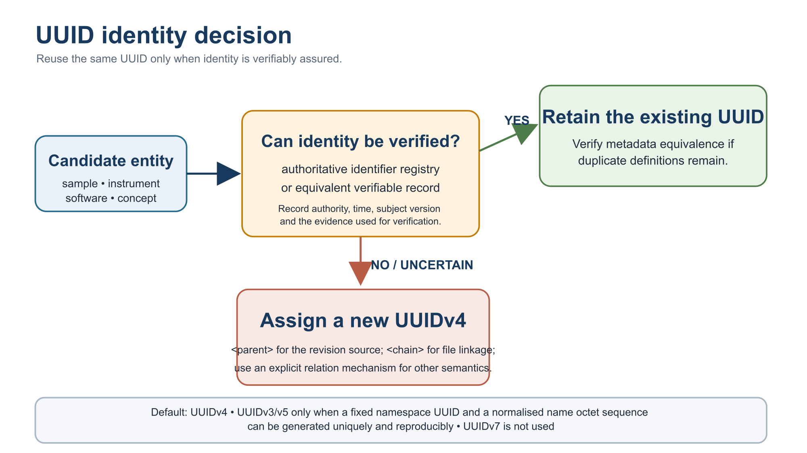
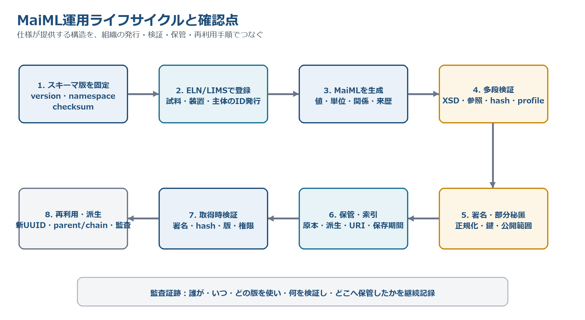
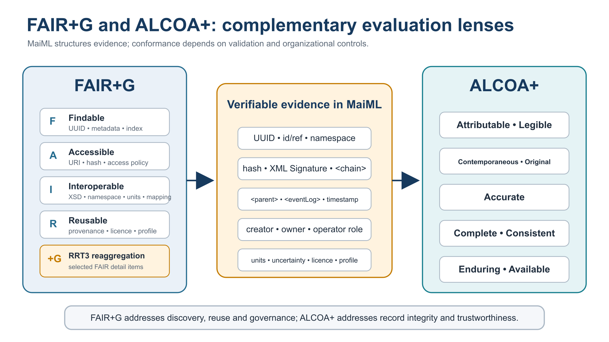

# MaiML 運用指針

**Operational Guideline（参考・別文書）**  
対象：MaiML Working Draft及びスキーマリリース1.1.0  
Version 0.8.14（Draft）  
Prepared by: VAMAS TWA 2 Project A45 Study Team  
2026

> このMarkdown版は、保存済みのWord版 v0.8.14から生成したレビュー・公開準備用の派生表現である。内容上の版はWord版と同じ0.8.14である。

## 目次

- [序文（位置付け）](#sec-0)
- [1 識別子（UUID）の運用](#sec-1)
- [2 発見可能性（Findability）の運用](#sec-2)
- [3 アクセス制御・秘匿の運用](#sec-3)
- [4 外部ファイル、hash及び正典の運用](#sec-4)
- [5 名前空間・語彙・関係語彙の運用](#sec-5)
- [6 数値・単位・不確かさの運用](#sec-6)
- [7 最小再現性プロファイルの運用](#sec-7)
- [8 ファイル粒度と派生管理](#sec-8)
- [9 運用システム連携（ELN／LIMS／SDL）](#sec-9)
- [9.1 複数のresultsと実行履歴の記録](#sec-9-1)
- [10 作成支援・検証・可視化](#sec-10)
- [11 署名・正規化・改ざん検知](#sec-11)
- [12 FAIR+G及びALCOA+の運用チェック](#sec-12)
- [13 ワークフロー設計](#sec-13)
- [14 スキーマreleaseとnamespaceの管理](#sec-14)
- [15 creatorRefとrelationTypeの運用](#sec-15)
- [16 作成・公開・受入チェックリスト](#sec-16)
- [17 ローカルidの命名と検証](#sec-17)
- [18 役割名・仮名識別子を用いたownerの運用](#sec-18)
- [19 同一UUIDの重複定義の扱い](#sec-19)
- [参考文献](#references)

## 序文（位置付け）

本書は、MaiMLの規格本文及びXMLスキーマに対する適合要求を追加するものではなく、組織・システム・利用環境に依存する運用を示す参考文書である。MaiMLが提供する識別、構造、関係、来歴、署名及び暗号化可能範囲を、UUID発行、鍵管理、アクセス制御、保存、検索、語彙管理及びツール運用へ接続するための推奨手順を示す [1], [2]。

本書は、ILC（RRT1〜3）でC：運用指針13件及びE：仕様の責務外18件に区分された事項を中心に整理する。RRTコメント全203件の内訳はA39／B70／C13／D14／E18／–49である。本書が示す手順はベストプラクティスであり、利用組織の法令、契約、品質マネジメント及び情報セキュリティ方針を置き換えない。

表0-1　MaiML文書体系における役割分担

| 層 | 担い手 | 内容 | 適合性との関係 |
| --- | --- | --- | --- |
| 仕様（規定） | WD本文・版付きXSD | 構造、識別、関係、履歴、暗号化可能範囲 | 適合要求 |
| 適用の手引（参考） | WD参考附属書 | 記述パターン、完全例、マッピング | 解釈支援 |
| 運用（本書） | 組織・運用基盤 | ID発行、鍵、語彙、保存、アクセス、profile | 組織固有の保証 |
| ツール／実装 | 参照実装・製品 | 生成、可視化、検証、変換、索引 | 実装確認 |
| 外部基盤 | リポジトリ・認証基盤等 | 検索、認証、認可、長期保存、語彙定義 | 仕様の責務外 |

本書では「保証」という語を、MaiML要素が存在するだけで達成される意味には用いない。MaiMLは評価・検証に必要な情報と構造を提供し、真正性、機密性、可用性及び説明責任の保証は、検証実装と運用統制を組み合わせて成立する。

表0-2　運用上の主な役割

| 役割 | 主な責任 | 保持する記録 |
| --- | --- | --- |
| Schema Maintainer | XSD、namespace、変更履歴、検証例を版付きreleaseとして公開 | release manifest、checksum、移行記録 |
| Identifier Authority | UUIDの発行、受け渡し、重複・衝突処理、廃止禁止 | 発行台帳、外部ID対応表、監査証跡 |
| Data Producer | MaiML作成、値・単位・関係・来歴の記録 | 作成ログ、profile、検証結果 |
| Data Steward | 語彙、保存、公開範囲、正典、品質レビュー | 語彙台帳、保存方針、承認記録 |
| Security Administrator | 鍵、証明書、RBAC、失効、復号権限 | 鍵台帳、アクセスログ、失効記録 |
| Repository Operator | 原本・派生の保管、索引、永続URI、取得時検証 | 保管ログ、hash、バックアップ記録 |

## 1　識別子（UUID）の運用

UUIDはグローバルな対象識別、id属性は文書内の局所識別に用い、互換的に扱わない。本指針ではUUIDv4を既定とする。装置又はソフトウェア等について、固定したnamespace UUIDと、識別対象から正規化したname octet sequenceを一意かつ再現可能に生成する規則を管理できる場合に限り、UUIDv3又はUUIDv5を用いる。RFC 9562に従い、可能な場合はUUIDv5をUUIDv3より優先する。DOI、ORCID、ROR等の外部識別子を入力に用いる場合は、入力文字列の正規化規則、namespace UUID、生成アルゴリズム及びその版を記録する。UUIDv7は採用しない。時系列の検索には`<event>`のtimestamp又は外部索引を用いる。同一UUIDを異なるファイルで維持する場合は、権威ある識別子台帳又は同等の検証可能な記録によって対象の同一性を確認し、照合主体、日時、対象版及び根拠を監査記録へ残す [3]。

表1-1　UUIDの発行・伝播・例外処理

| 段階 | 推奨手順 | 記録 |
| --- | --- | --- |
| 既存試料の登録 | Identifier Authorityが権威ある台帳又は同等の検証可能な記録で同一性を照合した後に、既存UUIDを受理する。 | 対象、発行者、照合日時、対象版、根拠 |
| 新規生成物 | 工程完了時に新UUIDを発行する。入力との関係は意味に応じて記録し、改訂元には`<parent>`、ファイル連結には`<chain>`、template/instance関係には`<templateRef>`/`<instanceRef>`を用いる。その他の派生関係は明示的な関係機構又はprofileで示す。 | 入力UUID、出力UUID、関係種別、工程 |
| 状態変化 | 同一実体であることを検証できる場合に限りUUIDを継承し、condition又はeventLogで状態を区別する。確認できない場合は新UUIDv4を発行する。 | 同一性の根拠、状態、時刻、操作 |
| MaiMLへの受け渡し | API又は選択UIでUUIDを渡し、コピー＆ペーストを通常手順にしない。 | 送信元・受信先・照合結果 |
| 再試行 | 同一要求を識別するidempotency keyを用い、再試行で別UUIDを乱発しない。 | 要求ID、発行済UUID |
| 衝突・重複 | 対象を隔離し、再利用せず、新UUIDを発行して旧値との対応を監査記録に残す。 | 旧値、新値、影響範囲 |
| 派生・匿名化 | 匿名化によって内容を変更した公開用複製は改訂版として扱い、新しいUUIDを付与し、`<parent>`で原本を改訂元として示す。その他の派生関係は、明示的な関係機構又はprofileで記録する。 | 派生理由、処理、関係種別、hash |
| 廃止 | 発行済UUIDを別対象へ再割当てしない。削除時も墓標メタデータを保持する。 | 廃止理由、保存期限 |

- DOI、ORCID、ROR、装置資産番号等の外部識別子はUUIDを置き換えず、対応表で管理する。

- 同一UUIDを維持できるのは、同一実体であることを検証できる場合に限る。確認できない場合、又は新しい実体・結果・派生内容を作成した場合は、新しいUUIDv4を発行する。この判断と証拠をprofile又はSOPで具体化する。

- 発行サービス停止時のオフライン発行、後同期及び衝突確認手順を事前に定める。

**図1-1　同一UUIDを維持するための判断**

## 2　発見可能性（Findability）の運用

UUID、chain及びparentは識別と既知対象からの辿りを支えるが、検索索引ではない。MaiMLを発見可能にするには、リポジトリ又はデータカタログへ文書UUID、試料、手法、装置、creator、日時、profile、ライセンス及び主要語彙を登録する。

- 正引き：UUID又は永続URIからMaiML又はアクセス案内へ到達できるresolverを用意する。

- 逆引き：`<parent>`は改訂関係、`<chain>`はファイル連結関係、refは各要素で定義された参照関係として索引化する。一般的な派生関係を検索する場合は、その意味を明示する関係機構又はprofileを用いる。

- 権限外データでも、存在、識別子、連絡先又は申請手順を示す公開メタデータの範囲を決める。

- 索引の再構築が可能なように、カタログ固有IDとMaiML UUIDの対応を保存する。

## 3　アクセス制御・秘匿の運用

W3C XML Encryptionは、XML要素又は要素内容の暗号化方式を規定するが、鍵、利用者及びアクセス方針は規定しない [5]。スキーマリリース1.1.0では、グローバル要素の子孫内容（`<uuid>`を除く）及び`<property>`/`<content>`の内容に`<EncryptedData>`を配置できる。タグ、属性、`<uuid>`及び参照解決に必要な情報は保持する。公開、共同研究限定、組織内、機密等の分類を定め、この範囲内で秘匿対象を選択する。`<insertion>`が参照する外部ファイルは別途暗号化できるが、その暗号化方式、復号及び鍵管理はMaiML XMLスキーマの規定範囲外である。

表3-1　秘匿化とアクセス制御の運用判断

| 対象 | 推奨 | 避けること |
| --- | --- | --- |
| 構造・識別子 | workflowの骨格、uuid、ref、暗号化箇所の存在を可能な範囲で保持 | 参照解決に必要な情報を無計画に隠す |
| 試料・配合・レシピ | 内容単位で暗号化し、公開可能な説明を別に残す | 同一UUIDのまま意味の異なる編集済み内容を配布 |
| 匿名化・仮名化 | 匿名化によって内容を変更した公開用複製は改訂版として扱い、新しいUUIDを付与し、`<parent>`で原本を改訂元として示す。その他の派生関係は、明示的な関係機構又は版付きprofileで示す。原本との対応表はアクセス制限下で管理する。 | 匿名化後の内容を原本と同一とみなすこと、又は`<parent>`を一般的な派生関係に流用すること |
| RBAC | 閲覧・作成・承認・復号・鍵管理を分離 | 単一共有アカウント又は復号鍵の無期限共有 |
| 鍵 | key ID、所有者、有効期限、失効、バックアップ、復旧試験を管理 | 鍵本体をMaiML文書へ平文保存 |

## 4　外部ファイル、hash及び正典の運用

スキーマリリース1.1.0の`<insertion>`は外部ファイルを参照する。画像、スペクトル、HDF5及び装置固有バイナリは、その代表例である。`<uri>`は所在、`<hash>`は取得したファイル内容の同一性、`<format>`は解釈形式を表す。外部ファイルのhashは保存対象のraw byte列全体に対して計算し、`<hash>`のmethod属性にアルゴリズム識別子を、要素値にスキーマで定義されたbase64Binary形式のdigestを記録する。文献、データベース又はクラウド資源は、外部ファイルとして固定した場合、又は版付きprofileが対象範囲を明示的に拡張した場合に参照する。後者を現行基本スキーマの適合範囲と混同しない。

HDF5は、group、dataset及びattributeを用いて大容量かつ多次元の科学データを保持し、部分読出し等を支えるコンテナである [16], [17]。MaiMLはHDF5を置き換えず、`<insertion>`から外部payloadとして参照する。`<uri>`にはHDF5ファイル、`<hash>`にはmethod属性及び保存したファイル全体のbyte列から得たbase64Binary形式のdigest、`<format>`にはapplication/vnd.hdfgroup.hdf5を記録する。HDF5内部のdataset path、file-format版、library版及びfilter／codec依存性は、版付きprofile又は名前空間付きpropertyで別に規定する。現行`<insertion>`へdataset path属性を追加したと解釈してはならない。

**図4-1　MaiMLとHDF5の責務分担**

表4-1　HDF5を外部payloadとして参照する場合の記録項目

| 項目 | 記録内容 | 確認理由 |
| --- | --- | --- |
| `<uri>` | 固定したHDF5ファイルへの相対又は永続URI | 再配置後も参照対象を解決する |
| `<hash>` | 保存したHDF5ファイル全体のraw byte列に対するmethod属性及びbase64Binary形式のdigest | アルゴリズムと取得内容の同一性を確認する |
| `<format>` | application/vnd.hdfgroup.hdf5（必要に応じて.h5又は.hdf5も記録） | 解釈形式を識別する |
| dataset path | 版付きprofile又は名前空間付きpropertyで例：/raw/intensityを対応付ける | ファイル内部の対象datasetを特定する |
| 依存版 | HDF5 file format、library及びfilter／codecの名称と版 | 長期読取と再現可能性を支える |
| dataset単位の完全性 | 必要に応じて別manifest又はprofileにdigestを記録する | `<insertion>`のhashは原則としてファイル全体を対象とする |

- 相対URIを用いる場合は基準MaiML文書又はcontainer rootを固定する。

- リポジトリ移転時は新URIを追加し、旧URIとhashの履歴を保持する。

- 外部メタデータをMaiML内部へ複製する場合、正典、取得日時、取得元版及び不一致時の優先規則を定める。

- ファイルを上書きせず、不変アーティファクトとして新UUID及び新hashを付与する。改訂元は`<parent>`、以前に作成されたファイルとの連結及びhash照合は`<chain>`で示す。一般的な派生関係は、明示的な関係機構又は版付きprofileで示す。

- 長期保存ではformatの仕様、読取ソフトウェア、MIME又は識別子及び必要な校正情報も保持する。

## 5　名前空間・語彙・関係語彙の運用

XML namespaceは語彙の出典と識別範囲を示し、同名語の衝突を防ぐが、意味自体を保証しない。組織は利用するnamespace、語彙版、term、定義URI、status及び対応語を語彙台帳で管理する。

- 公開済みURIを再利用し、版変更時に既存termの意味を黙って変更しない。

- termの追加、非推奨化、置換先及び有効日をchangelogへ記録する。

- relationTypeは文字列の自由記述ではなく、方向を定義した制御語彙又は名前空間付きIRIで管理する。

- 同義、上位・下位、対応関係は外部オントロジーで表し、MaiML namespaceと役割を混同しない。

## 6　数値・単位・不確かさの運用

formatStringは表示形式であり、有効数字、精度又は不確かさではない。物理量にはunitsを記録し、scaleFactor、データ型、値及び`<uncertainty>`を分けて保持する。十進小数をbinary float又はdoubleで扱う際の丸め差を考慮し、表示後の文字列から保存値を再生成しない [8]。

- 組織又は分野で推奨単位セット、表記、換算及び校正情報を定める。

- `<uncertainty>`には対象値、標準不確かさ又は拡張不確かさ、包含係数、信頼水準及び算出根拠を可能な範囲で関連付ける。

- 変換ツールではdecimal→float→decimal、単位換算、scaleFactor及び欠損値の往復試験を行う。

- 計算値と実測値、使用した物理定数及び定数版を区別する。

## 7　最小再現性プロファイルの運用

最小再現性プロファイルは、特定の用途で再実施又は再解析に必要な要素を列挙する運用上の契約である。profileには永続識別子、版、対象手法、必須／条件付き項目、許容語彙、検証規則、責任主体及び廃止方針を付す。

表7-1　profileに含める管理情報

| 項目 | 内容 |
| --- | --- |
| 識別 | profile ID、version、公開日、URI、管理主体 |
| 適用範囲 | 手法、試料種、利用目的、包含・除外条件 |
| 必須情報 | 試料、condition、protocol、result、eventLog、校正、外部ファイル |
| 検証 | XSDに加えて適用するルール、許容語彙、単位、しきい値 |
| 互換性 | 対応するMaiML schema版、旧profileからの移行 |

## 8　ファイル粒度と派生管理

ファイル粒度は、変更頻度、権限、再利用単位、外部ファイル量及び署名単位を基に決める。複数工程を一文書にまとめる場合も、個々の試料、条件及び結果をUUIDで識別する。分割する場合は、工程の入力及び出力を`<chain>`及び明示的なrefで接続する。分割後の文書が改訂版である場合に限り、`<parent>`で改訂元を示す。

- 一度公開又は署名したMaiML文書は不変とし、訂正・再解析・匿名化は新しいアーティファクトとする。

- 試料ごと、測定ごと、解析ごと等の推奨粒度をprofileに記載する。

- 同一文書に権限の大きく異なる情報を詰め込まず、部分秘匿又は文書分割を選択する。

## 9　運用システム連携（ELN／LIMS／SDL）

ELN又はLIMSをIdentifier Authority及び一次記録の保持者とし、MaiML生成時に試料、装置、利用者、protocol及び外部ファイルの識別子をAPI又は制御された選択UIで受け渡す。MaiMLは装置制御を行わず、LADS OPC UA、SiLA 2、CWL、WDL、RO-Crate等の外部層との受け渡し点を構造化する。

**図9-1　MaiML運用ライフサイクルと確認点**

表9-1　ELN／LIMSからMaiMLへの受け渡し

| 対象 | 発行・保持 | MaiMLへの受け渡し | 照合 |
| --- | --- | --- | --- |
| 試料 | LIMS item／sample record | material UUID／外部ID | 対象、lot、保管位置 |
| 実験 | ELN experiment／workflow | document UUID、protocol/templateRef | 版、実施日、承認 |
| 利用者 | 認証基盤／ELN | creator、owner（operator roleを含む） | アカウント、所属、役割 |
| 外部ファイル | Repository／ELN upload | insertion URI、hash、format | 取得時raw-byte hash |
| 実行履歴 | 装置・ELN event | eventLog、時刻、state、creatorRef | 時刻同期、欠落、重複 |

### 9.1　複数のresultsと実行履歴の記録

`<results>`の個数と`<log>`又は`<trace>`の個数を機械的に一致させない。`<log>`はmethodに対応する履歴のまとまり、`<trace>`はprogramに基づく一回の実行、`<event>`はinstructionに対応する操作として管理する。一回の実行で複数のresultsを生成した場合は、同じtrace内の該当eventから各resultsをresultsRefで参照する。同じ工程を反復した場合は実行ごとにtraceを分け、異なるmethodの履歴はlogを分ける。ELN、LIMS又は実行エンジンは、実行開始時にtraceの識別子を発行し、結果生成時にeventとresultsRefを自動的に対応付けることが望ましい。

## 10　作成支援・検証・可視化

MaiMLは人が直接検査できるXMLテキストである一方、複数UUID、複合workflow及び多数ファイルの全体理解にはViewerが有効である。記述時はELN/LIMS、コンバータ又は専用エディタによりUUIDの手入力、参照先の取り違え、型・単位及び多重度の誤りを防ぐ。

表10-1　段階的な検証

| 段階 | 確認内容 | 失敗時の扱い |
| --- | --- | --- |
| 1 XML | 整形式、文字コード、namespace宣言 | 作成を停止 |
| 2 XSD | 要素、属性、型、多重度、ID/IDREF | 適合不可 |
| 3 識別・参照 | UUID重複、ref、chain、parent、template/instance | 隔離して修正 |
| 4 数値・profile | units、scaleFactor、uncertainty、必須項目、語彙 | profile不適合 |
| 5 外部資源 | URI到達性、hash、format、正典 | 欠落又は変更を記録 |
| 6 署名・暗号 | Canonicalization、Reference、digest、署名、復号権限 | 真正性未確認として扱う |
| 7 表示 | Viewerで階層、workflow、時系列、関係をレビュー | 人による承認を保留 |

公開ツール及び参照実装はhttps://maiml-org.github.io/を入口として利用する。ただし、運用環境では採用するrelease、commit又は配布物checksumを固定し、サイト上の最新版へ無条件に追随しない [13]。

## 11　署名・正規化・改ざん検知

XML Signatureは、参照対象の完全性及び署名鍵による検証を支援するが、鍵を人物又は組織へ結び付ける本人性を自動的には保証しない [4]。署名profileでは、Reference URI、node-set、Transform、digest及びsignature algorithm、証明書検証、失効確認、時刻情報並びに正規化方式を固定する。Canonical XML 1.1は、版付きprofileで選択できる方式の一つである [6]。スキーマリリース1.1.0及びW3C XML Signatureに適合し、使用方式を明示した既存署名は引き続き検証対象とする。一つの正規化方式だけを要求する場合は、そのprofileを宣言した文書に限って適用する。

表11-1　署名・hash・暗号化の運用profile

| 項目 | 運用で固定する内容 |
| --- | --- |
| 署名対象 | 文書全体、要素、外部ファイル又は版付きprofileで許容した外部資源の別。Reference URI及びnode-set |
| 正規化 | Canonicalization方式、commentsの有無、namespaceの扱い |
| Transform | enveloped signature等の順序及び許容集合 |
| アルゴリズム | digest、signature、鍵長及び廃止日 |
| 証明書・鍵 | 発行者、key ID、所有者、期限、失効、更新、バックアップ |
| 検証記録 | 検証日時、実装版、結果、失敗理由、対象checksum |
| 外部ファイル | raw byte列へのhash。XML正規化との混同を避ける |
| 暗号化 | 対象要素、algorithm、key ID、復号権限、派生UUID |

## 12　FAIR+G及びALCOA+の運用チェック

MaiMLの構造はFAIR+G及びALCOA+の評価に必要な証拠を保持できるが、原則への適合は検証実装及び組織運用を含めて評価する [7], [11]。FAIR+Gの+Gは独立した追加質問又は一般的な認証ではなく、RRT3で指定したFAIR詳細項目を、識別・完全性、ファイル関係、秘匿及び利用条件の観点から補完的に再集計したものである。次の図表における「支援」は、要素の存在だけで保証が成立することを意味しない。

**図12-1　FAIR+G及びALCOA+を支える証拠と運用**

表12-1　FAIR+Gに対する構造的支援と運用統制

| 観点 | MaiMLが保持できる主な証拠 | 運用で確認すること |
| --- | --- | --- |
| Findable | UUID、試料・手法・creator等のmetadata | 外部索引、resolver、metadata公開範囲 |
| Accessible | URI、hash、format、公開可能な構造 | 認証、認可、RBAC、鍵及び取得手順 |
| Interoperable | XSD、namespace、units、id/ref、mapping情報 | 語彙版、crosswalk、損失記録及び往復試験 |
| Reusable | provenance、eventLog、license、profile、不確かさ | 利用条件、最小再現性、保存期間及び検証可能性 |
| +G（RRT3再集計） | UUID／hash、`<chain>`、`<EncryptedData>`、IRI:license | FAIR詳細項目の指定と集計根拠を保存し、独立評価とみなさない |

表12-2　ALCOA+に対する構造的支援と運用統制

| 原則 | MaiMLが支援する情報 | 運用で確認すること |
| --- | --- | --- |
| Attributable | creator、owner（operator roleを含む）、eventLog | アカウント・役割・署名者の真正性 |
| Legible | XML、XSD、namespace、Viewer | 復号可能性、フォント・ツール・仕様の長期利用 |
| Contemporaneous | event timestamp、state | 装置時刻同期、自動記録、事後入力の識別 |
| Original | uuid、hash、signature、parent（改訂元） | 原本指定、署名検証、改訂と一般派生の区別 |
| Accurate | value、units、uncertainty、protocol | 校正、変換試験、承認、誤差評価 |
| Complete | document/protocol/data/eventLog、profile | 必須情報、外部ファイル、profileで許容した外部資源及び逸脱の網羅 |
| Consistent | 参照、時刻、workflow構造 | 順序、版、タイムゾーン、重複・欠落 |
| Enduring | 不変UUID、hash、format | 保存期間、媒体移行、読取可能性、バックアップ |
| Available | URI、ライセンス、公開メタデータ | リポジトリ、認証・認可、resolver、復旧試験 |

## 13　ワークフロー設計（Workflow Engineering）

MaiMLのworkflow設計では、構造と意味、設計と実施、仕様と運用を分け、再利用可能な抽象構造に保つ [14], [15]。

1.　研究プロセスを操作（instruction）と状態（material／condition／result）に分解する。

2.　Petri Netのplace／transition／arcで順序、分岐及び依存を設計する。

3.　Templateで各nodeへ科学的意味を与える。

4.　具体的な機種、人及び場所はdocument層、実行時刻はeventLog層へ置き、protocolを抽象化する。

5.　実行時にInstanceを生成し、eventLogで実施、逸脱及び時刻を記録する。

6.　protocol、data及びeventLogが独立に利用でき、参照先が解決できることを検証する。

7. UUIDは対象の識別、`<chain>`はファイルの連結及びhash照合、`<parent>`は改訂元、`<templateRef>`/`<instanceRef>`はtemplateとinstanceの対応を示す。一般的な派生関係は、これらへ意味を上乗せせず、明示的な関係機構又は版付きprofileで示す。

8.　再利用可能な構造をWorkflow Patternとして版付きで蓄積する。

## 14　スキーマreleaseとnamespaceの管理

MaiML文書を再現可能に検証するには、単に「最新版XSD」を参照せず、作成時に使用したreleaseを固定する。`<maiml>`/@versionは文書モデル版をx.y形式で示し、schema releaseはx.y.z形式で管理する。releaseは、版付きschema URI又はxsi:schemaLocation、XSD一式、namespace、checksum、changelog、migration note、検証済み例及び適合試験を一体として公開する。互換なminor又はpatch releaseのために、既存文書へ新しい必須属性を追加しない。

表14-1　スキーマrelease manifest

| 項目 | 必須記録 |
| --- | --- |
| Release ID | major.minor.patch、公開日、status |
| Namespace | namespace URI、互換版の範囲、prefix例 |
| Artifacts | 全XSD、catalog、完全例、negative examples、tool profile |
| Integrity | 各配布物のalgorithm及びchecksum、署名がある場合は検証情報 |
| Compatibility | 後方互換性、breaking change、対応するWD版 |
| Migration | 旧版からの変換、情報損失、変換ツール版 |
| Deprecation | 非推奨要素、代替、終了日、旧版の検証継続期間 |
| Publication | 固定tag/release URL。moving branchだけを正式参照にしない |

## 15　creatorRefとrelationTypeの運用

スキーマリリース1.1.0では、`<creatorRef>`要素を`<eventLog>`配下及び`<document>`/`<creator>`配下で用いる。`<document>`/`<creator>`配下では0回以上を許容し、生成主体間の構成又は派生関係を表す。creatorRelationRefTypeは、ref属性に加えて任意のrelationType属性をもつ。relationType属性を省略した場合、関係の詳細な意味は未指定とする。`<eventLog>`配下の`<creatorRef>`要素の配置、型及び意味は、従来の用法を維持する。新しい配置又は属性を用いた文書は旧XSDでは検証できない場合があるため、使用したスキーマリリースを明示する。

**図15-1　creatorRefとrelationTypeの関係モデル**

表15-1　relationTypeの初期運用語彙

| 値 | 読み方 | 利用例 | 検証 |
| --- | --- | --- | --- |
| isPartOf | current creator isPartOf referenced creator | plugin → software suite | 参照先存在、循環の妥当性 |
| hasPart | current creator hasPart referenced creator | suite → bundled component | isPartOfとの逆関係整合 |
| derivesFrom | current creator derivesFrom referenced creator | modified converter → original | 同一性ではなく派生として扱う |
| uses | current creator uses referenced creator | converter → library | runtime／build依存の区別を注記 |

relationTypeは自由記述を避け、名前空間付き語彙として管理する。relationRefはスキーマリリース1.1.0には導入しない。関係そのものを独立オブジェクトとして版、根拠、作成者又は外部URI付きで管理する必要が生じた場合にのみ、その関係オブジェクトを参照する仕組みとして将来検討する。

## 16　作成・公開・受入チェックリスト

表16-1　運用チェックリスト

| 段階 | 確認項目 |
| --- | --- |
| 作成前 | schema release、profile、namespace、単位、UUID発行主体、正典及び公開区分を決定した。 |
| 作成 | UUIDを自動受渡しし、creator、owner（operator roleを含む）、protocol/data/eventLog、外部ファイル及び版付きprofileで許容した外部資源を記録した。 |
| 検証 | XML、XSD、参照、数値、profile、外部hash、署名及びViewer確認を実施した。 |
| 承認 | Data Steward及び必要な責任者が検証結果、秘匿範囲、ライセンス及び逸脱を確認した。 |
| 公開 | 不変アーティファクト、永続URI、checksum、公開メタデータ及び申請手順を登録した。 |
| 受入 | schema/profile版を取得し、署名・hash・参照・権限を検証して結果を保存した。 |
| 変更 | 上書きせず新UUIDを付与した。改訂元は`<parent>`、ファイル連結は`<chain>`で示し、一般派生は明示的な関係機構又はprofileで記録した。変更理由及び旧版との互換性も記録した。 |
| 保守 | 鍵失効、リンク切れ、format陳腐化、語彙廃止、schema移行及び復旧試験を定期点検した。 |

## 17　ローカルidの命名と検証

ローカルidは、xs:IDとして文書内の連結（ref解決）に用いる識別子であり、グローバル識別子ではない。文書を越えた同一性はUUIDが担う（箇条1参照）。システム境界、ペトリネット構造、入出力の方向、繰返し操作及び参照対象が増えるほどidの構成は複雑になるため、手作業での命名を避け、生成と検証を自動化する。

意味的な解釈をid文字列の解析だけに依存させない。権威ある意味は、ref解決、UUID、型及び明示的なメタデータから得る。idの命名規則は可読性と衝突回避のための便宜である。

表17-1　ローカルid運用の推奨規則

| 項目 | 推奨規則 | 備考 |
| --- | --- | --- |
| 生成 | authoring supportにより自動生成し、文書保存時に一意性を検証する | 手入力又はコピーによる重複は、典型的な不具合である |
| 構成 | 要素種別、対象、プロセス境界、役割又は方向、及び出現順から成る一意に再現可能なパターンで構成する例：mat-sampleA-p1-in-01 | パターンは組織のprofileで固定する |
| 解釈 | idの文字列解析に意味を依存させない。意味はref解決・UUID・型・メタデータで判断する | idはリンクのための便宜 |
| 複製 | 要素を複製した場合は子要素のid及びref先を必ず再検証する | 子要素のid及び参照要素のidは、衝突が生じやすい箇所である |
| 検証 | XSD検証に加え、id一意性・ref解決性を保存時と受入時の双方で確認する | 箇条10（作成支援・検証）参照 |

## 18　役割名・仮名識別子を用いた`<owner>`の運用

`<owner>`は、スキーマリリース1.1.0における意味範囲に従い、計測分析の実施者、データ所有者又は責任をもつ個人・組織を示し、自動計測では責任者又はanonymousを示すことができる。一方、利用者識別子は装置、ソフトウェア、ワークステーション及び組織の認証基盤の間で必ずしも一致せず、個人情報は法令の対象となり得る。直接識別情報を目的なくMaiML文書へ複製しない。

表18-1　`<owner>`記載のパターン

| 配布範囲 | 推奨する記載 | 本人特定の方法 |
| --- | --- | --- |
| 組織内・アクセス統制下 | 実名又は組織の利用者識別子 | 組織の認証基盤・ELN／LIMSの記録 |
| 共同研究・限定共有 | 役割名又は仮名識別子（例：operator-A、qc-reviewer） | アクセス統制されたID対応表（ELN／LIMS等）で管理 |
| 一般公開 | anonymous、役割名又は責任組織名 | 必要時は公開元組織への照会による |

本指針では、匿名化によって内容を変更した公開用複製を原本の改訂版として扱う。公開用複製には新しい文書UUIDを付与し、改訂元である原本を`<parent>`で示す（箇条8参照）。その他の一般的な派生関係には、明示的な関係機構又は版付きprofileを用いる。匿名化（復元不能）、仮名化（対応表で復元可能）、暗号化（鍵で復元可能）及びRBAC（閲覧統制）は異なる手段であり、目的に応じて使い分ける（箇条3参照）。実体識別子と役割名との対応表は、アクセス統制された認証基盤又はELN／LIMSに保持し、MaiML文書には含めない（箇条9参照）。

## 19　同一UUIDの重複定義の扱い

同一の装置、ソフトウェア又は役割を、同一UUIDのまま異なるローカルidで文書内に複数回定義する記述は、スキーマリリース1.1.0では妥当（valid）である。しかし、メタデータの重複は不一致（drift）の原因になる。次の規則を推奨する。

表19-1　同一実体の定義に関する判断

| 状況 | 推奨 | 理由 |
| --- | --- | --- |
| 実体・版・シリアル番号・計算環境が不変 | 権威ある台帳又は同等の検証可能な記録で同一性を確認した場合に限り、文書内で1回だけ定義し、複数のtrace・eventから同じ定義を参照する | 同一性の根拠を残し、重複メタデータの不一致を構造的に防ぐ |
| 版、シリアル番号、計算環境、実施者又は責任主体が実際に変わる | 別の定義と新しいUUIDを作成し、必要なら関係を明示する | 同一UUIDの実体は同一でなければならない |
| 実装上の理由で重複定義を残す | 同一性が権威ある記録で保証される場合に限り、同一UUIDをもつ定義同士のメタデータ等価性をsemantic validatorで確認する | XSD検証だけでは同一性及びmetadata driftを検出できない（箇条10参照） |

本章は運用の推奨であり、スキーマへの新たな制約の追加を意味しない。

## References

[1] MaiML Project, MaiML ISO Working Draft, Version 1.28.0, 2026.

[2] VAMAS TWA 2 Project A45 Study Team, MaiML Technical Report, Version 6.26.0, 2026.

[3] IETF RFC 9562, Universally Unique IDentifiers (UUIDs), 2024. https://www.rfc-editor.org/rfc/rfc9562

[4] W3C, XML Signature Syntax and Processing Version 1.1, W3C Recommendation, 2013. https://www.w3.org/TR/xmldsig-core/

[5] W3C, XML Encryption Syntax and Processing Version 1.1, W3C Recommendation, 2013. https://www.w3.org/TR/xmlenc-core1/

[6] W3C, Canonical XML Version 1.1, W3C Recommendation, 2008. https://www.w3.org/TR/xml-c14n/

[7] Wilkinson, M. D. et al., “The FAIR Guiding Principles for scientific data management and stewardship,” Scientific Data, 3, 160018 (2016). https://doi.org/10.1038/sdata.2016.18

[8] JCGM 100:2008(E), Evaluation of measurement data — Guide to the expression of uncertainty in measurement; Amendment 1:2026. https://doi.org/10.59161/JCGM100-2008E

[9] ISO/IEC 27001:2022, Information security, cybersecurity and privacy protection — Information security management systems — Requirements.

[10] World Health Organization, Guidance on good data and record management practices, WHO Technical Report Series No. 996, Annex 5, 2016.

[11] PIC/S PI 041-1, Good Practices for Data Management and Integrity in Regulated GMP/GDP Environments, 2021.

[12] MaiML Project, Official website. https://www.maiml.org/

[13] MaiML Project, Tools and reference implementations. https://maiml-org.github.io/

[14] MaiML Project, The MaiML Manifesto, Draft Version 0.2.0, 2026.

[15] MaiML Project, MaiML Design Principles, Draft Version 0.3.0, 2026.

[16] The HDF Group, HDF5, official product page. https://www.hdfgroup.org/solutions/hdf5/ (accessed 2026-07-31).

[17] The HDF Group, Introduction to HDF5, HDF5 Field Guide. https://portal.hdfgroup.org/documentation/hdf5/latest/_intro_h_d_f5.html (accessed 2026-07-31).

---

生成情報: source `MaiML_運用指針_OperationalGuideline_v0.8.14.docx`, SHA-256 `cbb3fd104cacda332048d30f41f03264e9d58d6217a23374b33b69279c33252a`.
